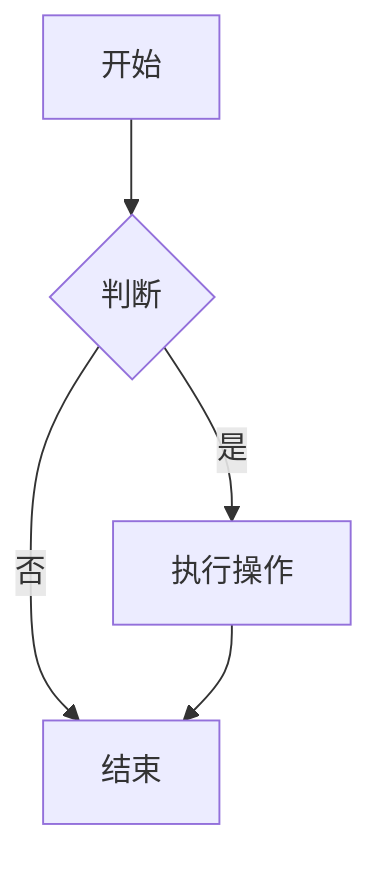
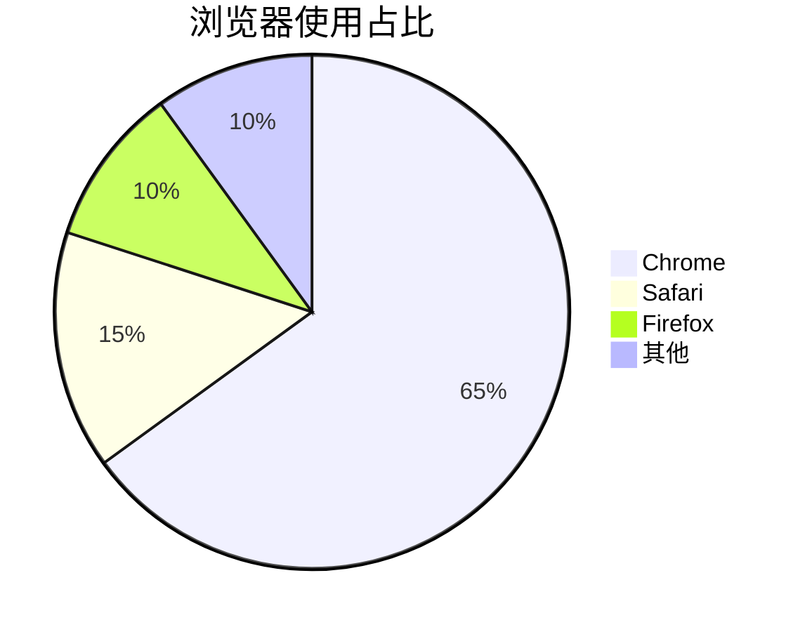

# Markdown 元素测试页面

这个页面展示了所有常见的 Markdown 元素及其语法。

> [!NOTE]
> Useful information that users should know, even when skimming content.

> [!TIP]
> Helpful advice for doing things better or more easily.

> [!IMPORTANT]
> Key information users need to know to achieve their goal.

> [!WARNING]
> Urgent info that needs immediate user attention to avoid problems.

> [!CAUTION]
> Advises about risks or negative outcomes of certain actions.

## 1. 标题

# H1 标题
## H2 标题
### H3 标题
#### H4 标题
##### H5 标题
###### H6 标题

## 2. 文本样式

**粗体文本**
*斜体文本*
***粗斜体文本***
~~删除线文本~~
<u>下划线文本</u>
`行内代码`
H~2~O（下标）
X^2^（上标）

==高亮文本==

## 3. 列表

### 无序列表
- 项目一
- 项目二
  - 子项目一
  - 子项目二
    - 孙项目
- 项目三

### 有序列表
1. 第一项
2. 第二项
   1. 子项一
   2. 子项二
3. 第三项

### 任务列表
- [x] 已完成任务
- [ ] 待完成任务
- [ ] 另一个任务

## 4. 引用

> 这是一个引用
> 
> 引用中的第二段
> 
> > 嵌套引用
> 
> 回到第一层引用

## 5. 代码块

行内代码：`console.log("Hello World")`

### JavaScript 代码
```javascript
function helloWorld() {
    console.log("Hello, World!");
    return 42;
}
```

### Python 代码
```python
def hello_world():
    print("Hello, World!")
    return 42
```

### 纯文本代码
```
没有任何语法高亮的代码块
```

## 6. 表格

| 列1标题 | 列2标题 | 列3标题 |
|---------|---------|---------|
| 单元格1 | 单元格2 | 单元格3 |
| 左对齐 | 居中对齐 | 右对齐 |
| 数据1 | 数据2 | 数据3 |

### 对齐方式
| 左对齐 | 居中对齐 | 右对齐 |
|:--------|:--------:|--------:|
| 文本左 | 文本中 | 文本右 |
| 数据左 | 数据中 | 数据右 |

## 7. 链接和图片

[普通链接](https://example.com)
[带标题的链接](https://example.com "链接标题")

### 引用式链接
这是一个引用式链接：[示例][1]和另一个[引用][2]

[1]: https://example.com "示例链接"
[2]: https://example.org

### 图片


### 引用式图片
![替代文本][img1]

[img1]: https://via.placeholder.com/300x100 "引用式图片"

## 8. 分割线

下面是分割线：

---

另一种分割线：

***

## 9. 脚注

这是一个带有脚注的文本[^1]。

这是另一个脚注[^2]。

[^1]: 这是第一个脚注的内容。
[^2]: 这是第二个脚注的内容，可以包含多行文本。

## 10. 定义列表

苹果
: 一种水果，通常是红色或绿色

香蕉
: 一种黄色的水果

橙子
: 柑橘类水果，富含维生素C

## 11. Emoji

:smile: :heart: :rocket: :thumbsup: :warning:

## 12. 数学公式

行内公式：$E = mc^2$

块级公式：
$$
\sum_{i=1}^{n} i = \frac{n(n+1)}{2}
$$

## 13. 图表（Mermaid）





## 14. HTML 元素

<p style="color: blue;">这是一个带有样式的 HTML 段落。</p>

<details>
<summary>点击展开详情</summary>
这是一个隐藏的详细信息块。
</details>

## 15. 转义字符

\*这个星号不会被解释为斜体\*
\\ 反斜杠
\` 反引号
\[ 方括号

## 16. 复选框

- [x] 任务1
- [ ] 任务2
- [ ] 任务3

## 17. 缩写

这个文档使用 Markdown 编写，HTML 是其超集。

*[HTML]: 超文本标记语言
*[Markdown]: 轻量级标记语言

## 18. 上标和下标

水的化学式：H~2~O

勾股定理：a^2^ + b^2^ = c^2^

## 19. 注音

Markdown<ruby>标注<rt>biāo zhù</rt></ruby>测试

## 20. 内联属性

这是一个普通段落。

{#special .highlight style="color: red;"}
这个段落有 ID、class 和内联样式。

## 21. 目录

[[TOC]]

## 22. 注释

<!-- 这是一个注释，不会在渲染后显示 -->

这是一个可见的段落。

<!-- 多行注释
这是注释的第二行 -->

## 23. 特殊符号

&copy; 2023 版权所有
温度：25&deg;C
分数：&frac12;
箭头：&rarr; &larr; &uarr; &darr;

## 24. 进度条

进度：[======    ] 60%

## 25. 键盘按键

按 <kbd>Ctrl</kbd> + <kbd>C</kbd> 复制
按 <kbd>Cmd</kbd> + <kbd>Q</kbd> 退出

---

**结束语**：这个文档展示了大多数常用的 Markdown 元素。不同的 Markdown 解析器可能支持不同的功能扩展。